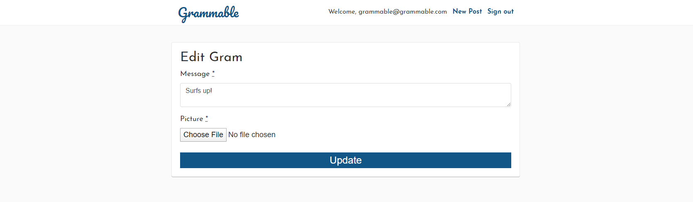

# OVERVIEW

*  A user-friendly photo sharing app that was built using industry-standard, test-driven development following numerous red/green refactor cycles.
*  View the app here: <a href="https://grammable-nick-parsley.herokuapp.com/">Grammable</a>

# LANDING PAGE

* Landing page will show the grams that have been added by users.
* Grams most recently added will appear first.

* Users must be signed in to add a gram or comment on another user's gram.

# GRAM OPTIONS

* A signed-in user can create a new gram by clicking new post.

* A signed-in user will be given the ability to edit or destroy grams that they created.
* A prompt will pop-up and ask the user for verification before deleting a gram.

